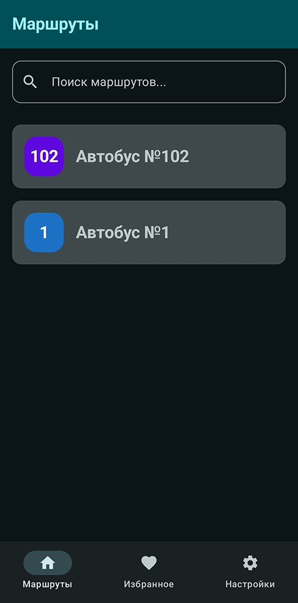
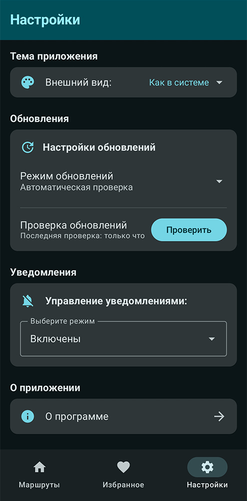
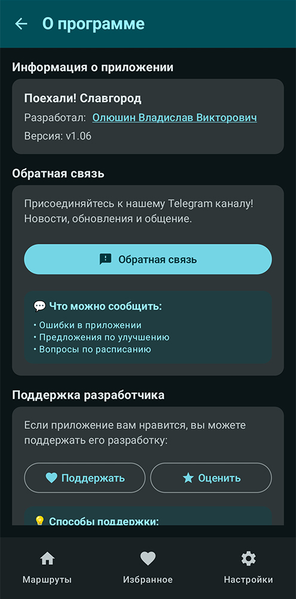

    

        
    

    <h1>Поехали! Славгород</h1>
    

        

# О приложении
**«Поехали! Славгород»** — мобильное приложение для отслеживания расписания городских автобусов города Славгород. Разработано с целью предоставления пользователям быстрого доступа к актуальной информации о маршрутах и времени движения транспорта.

# Важно!
> **Это неофициальное приложение, не имеющее отношения к ООО «Транспорт». Разработано энтузиастами для вашего удобства как справочный сервис.**

## Ключевые особенности

### **Функциональность**
- **Актуальное расписание** - автоматическое обновление из GitHub.
- **Динамическое обновление** - изменяйте расписание без выпуска новой версии APK.
- **Офлайн работа** - все данные доступны без подключения к интернету.
- **Умные уведомления** - настраиваемые напоминания о времени отправления с вибрацией.
- **Избранные маршруты** - сохранение часто используемых маршрутов.
- **Быстрый поиск** - удобный поиск по номеру и названию маршрута.

### **Дизайн**
- **Material Design 3** - современный и интуитивный интерфейс.
- **Темная/светлая тема** - автоматическое переключение по системным настройкам.
- **Адаптивный дизайн** - оптимизирован для всех размеров экранов.
- **Доступность** - поддержка скрин-ридеров и специальных возможностей.

### **Технические особенности**
- **Jetpack Compose** - современный UI toolkit.
- **Room Database** - локальное хранение данных.
- **Kotlin Coroutines** - асинхронное программирование.
- **Clean MVVM архитектура** - чистая и масштабируемая архитектура с Use Cases.
- **Удалённая загрузка данных** - расписание загружается из GitHub в реальном времени.
- **Многоуровневое кэширование** - GitHub → Локальный кэш → Assets → Hardcoded.
- **Автоматические обновления** - система проверки и установки обновлений приложения.
- **CI/CD** - автоматизация сборки и тестирования через GitHub Actions.
- **Статический анализ** - контроль качества кода с Detekt.

## Скриншоты
   

## Требования к телефону
- Android 7.0 или выше
- 50 МБ свободного места
<<<<<<< HEAD
- Разрешения: уведомления, точные будильники
=======
- Разрешения: уведомления, точные будильники, вибрация
- Интернет (опционально, для обновления расписания)

---

## 🔄 Динамическое обновление расписания

Приложение поддерживает **автоматическое обновление расписания** из GitHub!

### Для разработчика:

1. Разместите файл `routes_data.json` в вашем GitHub репозитории
2. Настройте URL в `RemoteDataSource.kt`
3. Изменяйте расписание прямо в GitHub - без выпуска новой версии приложения

### Для пользователей:

- **Автоматическое обновление** при запуске приложения
- **Ручное обновление** через Настройки → Управление данными → "Обновить расписание"
- **Работа оффлайн** благодаря локальному кэшированию

📖 **Подробная инструкция:** см. `SETUP_GITHUB_DATA.md` и `QUICK_START.md`

---
>>>>>>> 15855ad61d96aadd456ba237f0f3b4eb46b3729f
