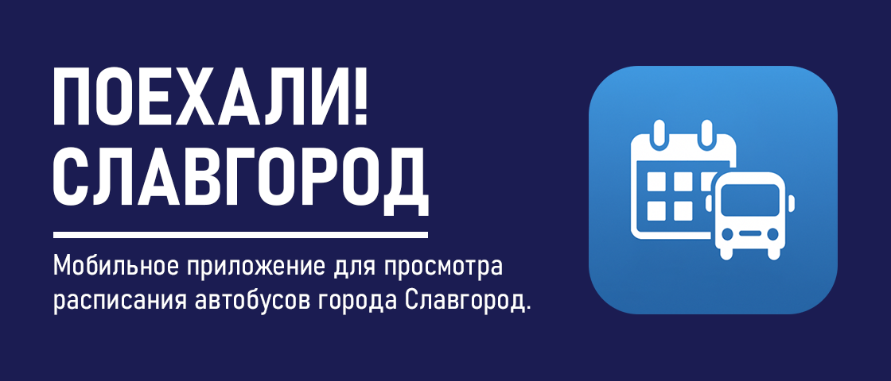
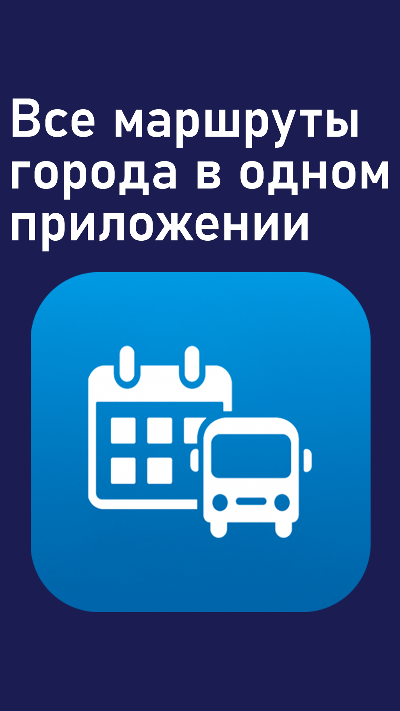
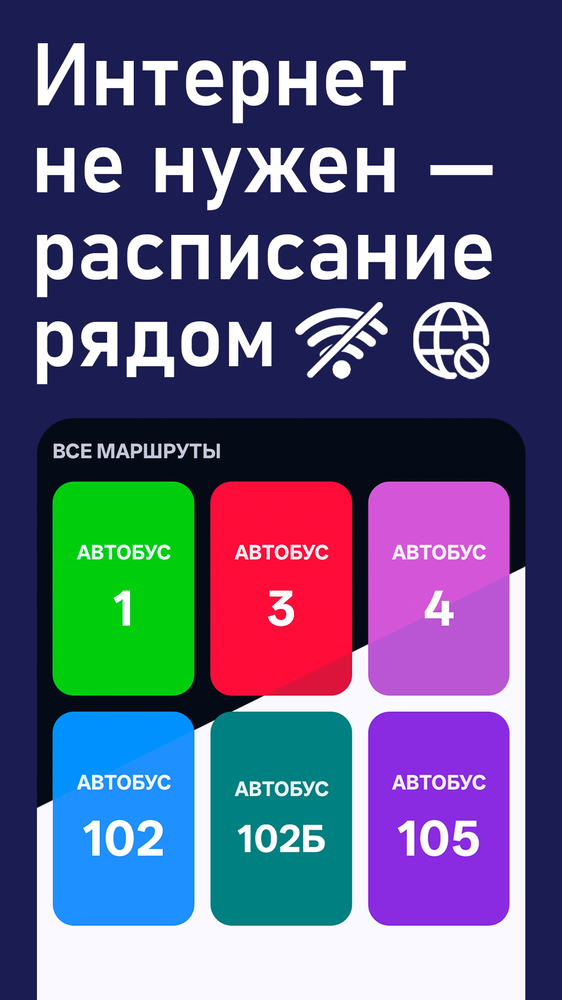
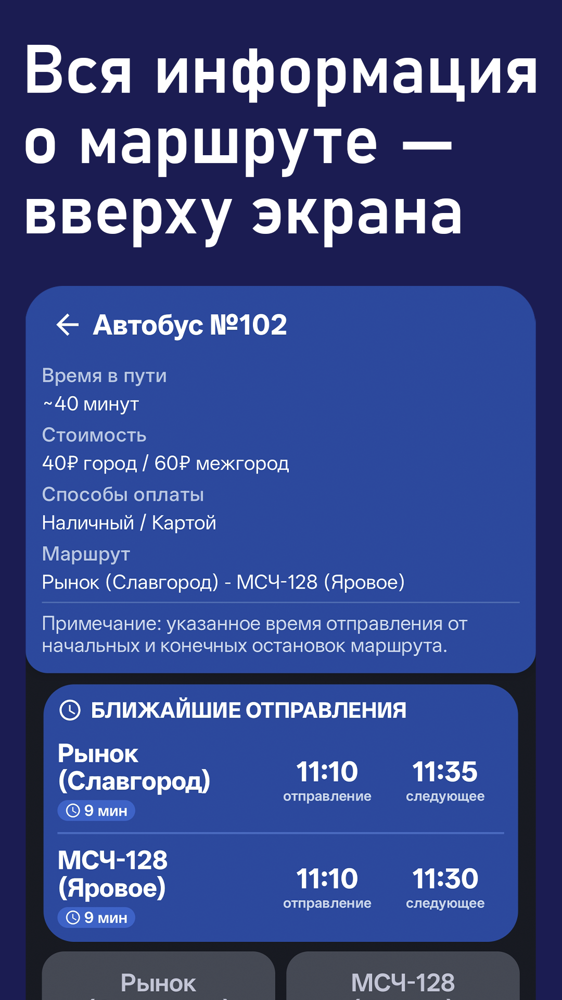
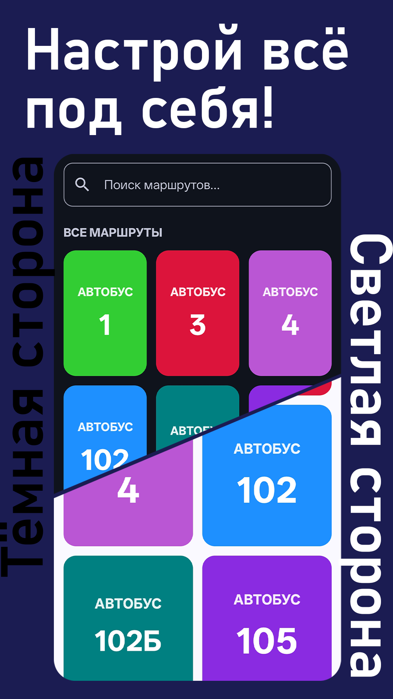

# Поехали! Славгород

> [!IMPORTANT]
> «Поехали! Славгород» - неофициальное справочное приложение о городских и пригородных маршрутах Славгорода. Проект не связан с администрацией, государственными учреждениями, перевозчиками или другими официальными организациями и не является их официальным продуктом.

## О проекте

Приложение «Поехали! Славгород» является неофициальным справочным приложением, не связано с администрацией, государственными учреждениями, такими перевозчиками, как ООО «Славгородское АТП», МУП «Торговый ряд г. Славгород», или иными муниципальными организациями, и не является их официальным приложением.

## Возможности

- список городских и пригородных маршрутов;
- поиск по номеру, названию, описанию, остановкам и времени отправления;
- отдельный экран расписания с фильтрами и ближайшими рейсами;
- закрепление избранных маршрутов;
- настройка источника данных расписания;
- системные уведомления об изменениях расписания;
- настройки темы, отображения и поведения интерфейса;

## Документация и сайт

- [Публичная страница проекта](https://vsemirka200.github.io/lets-go-slavgorod/)
- [Страница расписания](https://vsemirka200.github.io/lets-go-slavgorod/schedule.html)
- [Политика безопасности](https://drive.google.com/file/d/1DsT6W4P2a21jH7KYwEBNUdwZCR4_hRtE/view?usp=sharing)
- [Политика конфиденциальности](https://drive.google.com/file/d/1bru5Lo_PxcHaKhbvd50HXfUSo313j4Wp/view?usp=sharing)
- [Используемые библиотеки](https://drive.google.com/file/d/1ie1B3zC8lElfXiPFyVj58C669fvtAVVd/view?usp=sharing)

## Скриншоты

   

## Обратная связь

Сообщить об ошибке, предложить улучшение или задать вопрос можно через [контакты](https://vsemirka200.github.io/lets-go-slavgorod/index.html#feedback).
