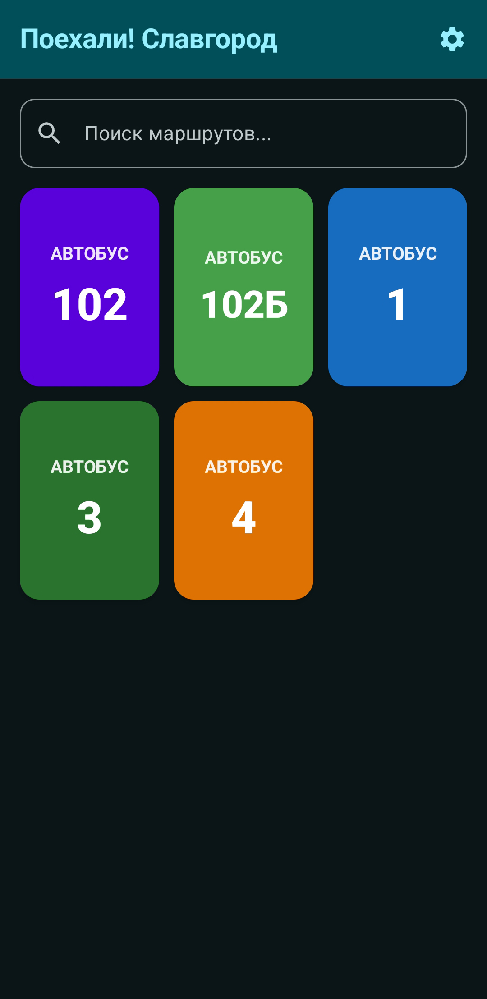
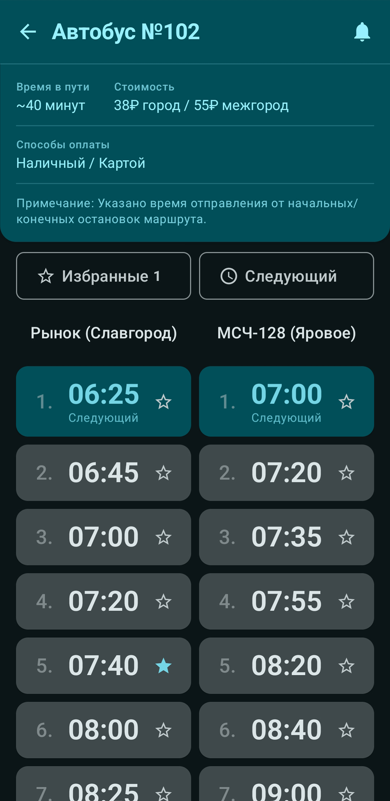
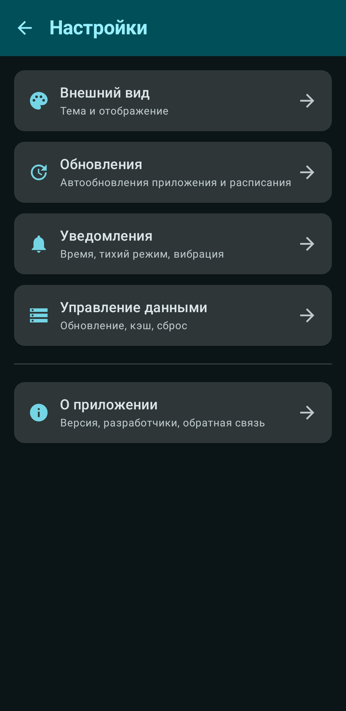

# Поехали! Славгород

---

<table>
<tr>
<td style="background-color: #fff3cd; border-left: 4px solid #ffc107; padding: 10px;">

**⚠️ ВАЖНОЕ ПРЕДУПРЕЖДЕНИЕ ⚠️**

Данное приложение предоставляет информацию о расписании автобусов только в **СПРАВОЧНЫХ ЦЕЛЯХ**. 
- Время отправления может отличаться от указанного в приложении
- Маршруты могут быть изменены без предварительного уведомления
- В непогоду расписание может быть скорректировано
- При проведении дорожных работ маршруты могут быть перенаправлены
**Рекомендуем уточнять актуальную информацию у транспортной компании. Разработчики не несут ответственности за возможные неудобства, связанные с неточностью расписания.**

</td>
</tr>
</table>

---

## Описание
**Поехали! Славгород** — это удобное приложение для жителей и гостей города Славгород, которое помогает быстро найти нужный автобус и узнать точное время его отправления.

### Основные возможности:
- Полное расписание всех городских и пригородных маршрутов
- Поиск маршрутов по номеру или названию
- Избранные рейсы для быстрого доступа к нужному времени
- Уведомления о приближающемся отправлении
- Автоматические обновления расписания через GitHub

---

## Возможности приложения

### Расписание
- Просмотр полного расписания для каждого маршрута
- Разделение по дням недели (будни/выходные)
- Подсветка ближайших рейсов

### Избранное
- Добавление рейсов в избранное одним касанием
- Быстрый доступ к часто используемым рейсам
- Настройка уведомлений для избранных рейсов
- Управление списком избранного

### Уведомления
- Push-уведомления о приближающемся отправлении

### Обновления
- Автоматические обновления расписания через GitHub
- Уведомления о доступности новых версий

---

## Технические особенности
- **Jetpack Compose** - современный UI toolkit
- **Room Database** - локальное хранение данных
- **Kotlin Coroutines** - асинхронное программирование
- **Clean MVVM архитектура** - чистая и масштабируемая архитектура с Use Cases
- **Удалённая загрузка данных** - расписание загружается из GitHub в реальном времени
- **Многоуровневое кэширование** - GitHub → Локальный кэш → Assets → Hardcoded
- **Автоматические обновления** - система проверки и установки обновлений приложения
- **CI/CD** - автоматизация сборки и тестирования через GitHub Actions
- **Статический анализ** - контроль качества кода с Detekt

## Скриншоты
   

---

## Установка

### Требования
- Android 7.0 (API 24) или выше
- 50 МБ свободного места
- Интернет-соединение для обновлений расписания

### Установка из APK
1. Скачайте последний APK из раздела [Releases](https://github.com/VseMirka200/lets-go-slavgorod/releases)
2. Включите "Установка из неизвестных источников" в настройках Android
3. Установите APK файл
4. Запустите приложение

---

## Статистика проекта

Версия: 2.0  
Последнее обновление: Октябрь 2025  
Языки: Kotlin (100%)  
Платформа: Android  

---

*Создано с ❤️ для жителей города Славгород*
